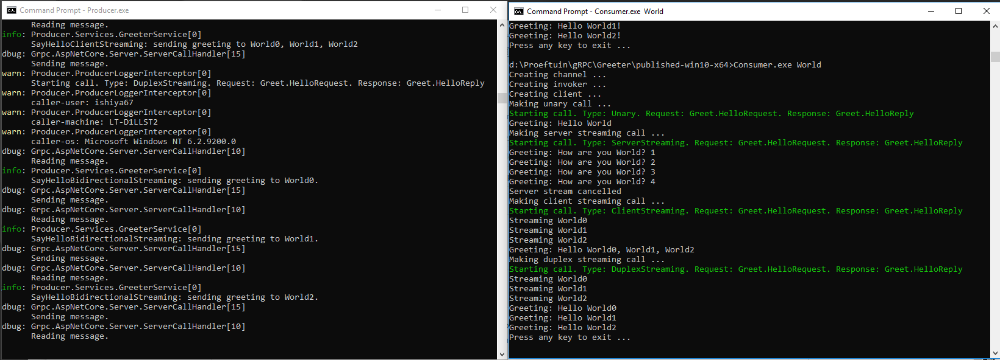

# Greeter

This example was composed from different examples provided in [gRPC for .NET](https://github.com/grpc/grpc-dotnet).

## Running

Start the `publish-win10-x64.cmd` in a command prompt. This will create a `published-win10-x64` folder.
Start two command shells in tis folder, execute `Producer.exe` in the first one and `Consumer.exe World` in the second one.
You should see something like captured in a screenshot below.

## Unit and integration testing

Open solution in Visual Studio and run all unit tests.
